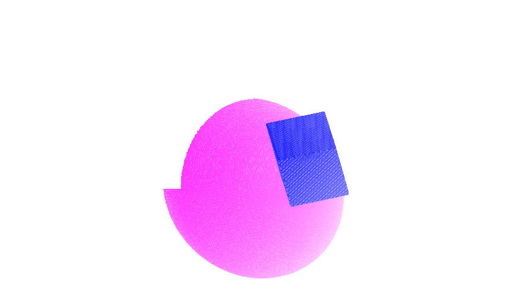

# Welcome to Open Render
Open Render is a single-header C++ 3D rendering engine that outputs raw RGBA values. It has various drawing functions and rotations. It is well documented and has a web demo.



## Quick Start
First, clone the repository.

With URL
```bash
git clone https://github.com/Bean91/Open-Render.git
```
Or with SSH
```bash
git clone git@github.com:Bean91/Open-Render.git
```
Then, include the file in your code.
```cpp
#include "open_render.hpp"
```

For extended documentation, please view the [docs](docs/introduction.md)

## Important Notes
This was made as a school semester project (v1 at least).

If you would like to contribute, please look at [`CONTRIBUTING.md`]("CONTRIBUTING.md")
